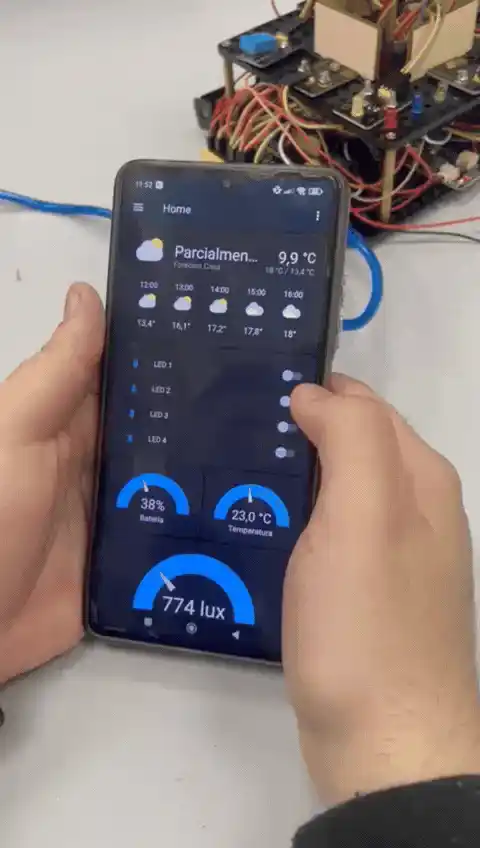
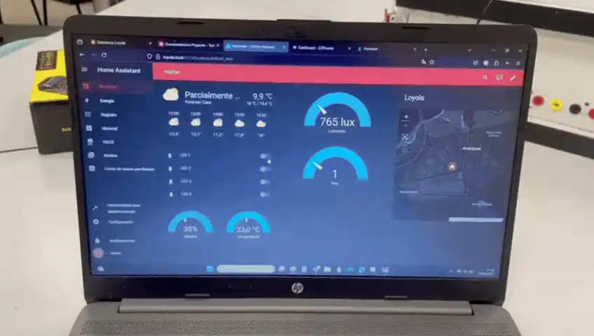

Este proyecto no fue desarrollado completamente desde cero. 
El código original del Arduino, proporcionado por el kit de Keyestudio, 
fue modificado y ampliado mediante la incorporación de nuevas funciones y mejoras adicionales.
 
El sistema usa un seguidor solar con cuatro sensores LDR que detectan la luz y ajustan
la posición del panel mediante servomotores para que siempre esté en el mejor
ángulo. Además, incluye sensores como el DHT11, que mide la temperatura y la
humedad, tambien una pantalla LCD donde se pueden ver los datos básicos. Pero para
hacer el proyecto más completo, añadimos una Orange Pi, que recoge toda la
información a través de un ESP32 y la muestra en Home Assistant, permitiendo
acceder a los datos de forma más cómoda y organizada desde cualquier dispositivo de
la red.
 

  

 

Para que todo funcione de manera más ordenada, también incluimos Portainer, que
nos permite manejar los contenedores Docker donde corren las aplicaciones, y
Nextcloud, que actúa como una nube privada para almacenar archivos. Todo esto se
puede gestionar desde una página web que hemos montado, donde se encuentran
accesos rápidos a Home Assistant, Portainer y Nextcloud, facilitando el uso del sistema.
 

  

 
