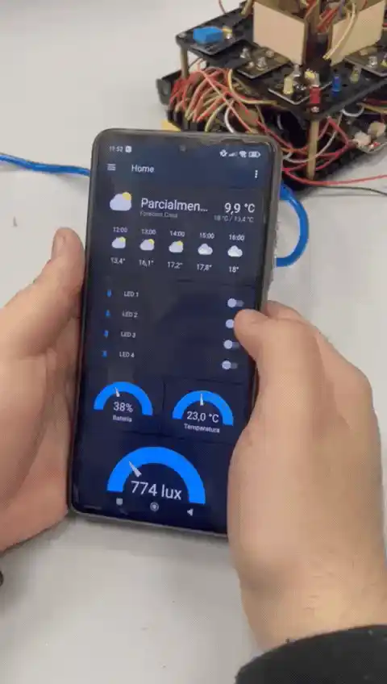
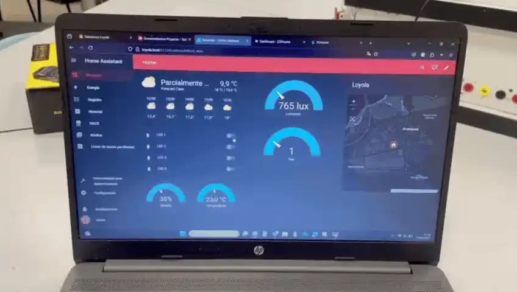
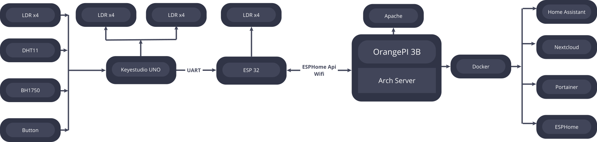

<div align="center">

# ☀️ Smart Solar Tracker

Dual-axis solar tracker with real-time monitoring in Home Assistant, running on a self-hosted Orange Pi.


</div>

## ✨ Overview

This project builds on the **Keyestudio KS0530 Solar Tracking Kit**. The original Arduino code was modified and expanded with new functions, and the data is now sent through an ESP32 to **Home Assistant**, running on an **Orange Pi 3B**, so it can be monitored from any device on the local network.

## 🚀 Demo

<div align="center">
  <table>
    <tr>
      <td align="center"></td>
      <td align="center"></td>
    </tr>
    <tr>
      <td align="center">Phone · Home Assistant Android app</td>
      <td align="center">PC · Home Assistant in the browser</td>
    </tr>
  </table>
</div>

## 💡 Features

| Feature | Description |
|---|---|
| Solar tracking | The panel follows the strongest light source on two axes |
| Environment monitoring | Temperature, humidity and light level in real time |
| Local display | Key values shown on the device itself |
| Adjustable step | A button changes the tracking step from 1 to 5° with sound feedback |
| Dashboard | All data in Home Assistant, from any device on the network |
| Remote control | 4 LEDs switched from the dashboard |
| Self-hosted tools | Docker management and a private cloud |
| Start page | One web page with quick links to every service |

## 🛠️ Architecture

<div align="center">



</div>

**UART:** `light|temp|hum|lr|ud|resolution`

## ⚙️ Hardware

| Component | Role |
|---|---|
| Keyestudio KS0530 kit (Keyestudio UNO) | Tracker structure, Servos x2, LDRs x4, button, buzzer, LCD |
| BH1750 | Accurate light intensity (lux) |
| DHT11 | Temperature and humidity |
| Solar module + 18650 battery | Power and USB charging |
| ESP32 | Wi-Fi bridge running ESPHome |
| Orange Pi 3B | Running Docker containers (Arch Linux; Ubuntu Server recommended) |

## 🔌 Wiring

| Device | Arduino pin |
|---|---|
| LDRs (left, right, up, down) | `A0`, `A1`, `A2`, `A3` |
| Servo horizontal / vertical | `D9` / `D10` |
| DHT11 | `D7` |
| Button | `D2` |
| Buzzer | `D6` |
| LCD and BH1750 (I²C) | `A4` (SDA), `A5` (SCL) |
| ESP32 power | 3.3 V pin of the Arduino |

## 💾 Data format

The Arduino sends one line per cycle, and ESPHome splits it into sensors:

| Position | 1 | 2 | 3 | 4 | 5 | 6 |
|---|---|---|---|---|---|---|
| Value | Light (lux) | Temperature (°C) | Humidity (%) | LR angle (°) | UD angle (°) | Resolution (1–5) |


## 📂 Repository

| Path | Description |
|---|---|
| [`web/`](web/) | Start page served by Apache |
| [`img/`](img/) | README media (demo videos) |
| [`LICENSE`](LICENSE) | Project license |
| [`README.md`](README.md) | Project documentation |
| [`solar_panel.ino`](solar_panel.ino) | Arduino firmware: tracking, sensors, LCD and UART output |
| [`esphome_code.yaml`](esphome_code.yaml) | ESPHome configuration for the ESP32 |
| [`commands.txt`](commands.txt) | Commands used to set up the Orange Pi |
| [`docker-compose.yaml`](docker-compose.yaml) | Docker Compose stack for the services |
| [`doc.pdf`](doc.pdf) | Full project report (Spanish) |


## 🔧 Setup

| Step | What to do |
|---|---|
| 1. Arduino | Install `LiquidCrystal_I2C`, `BH1750`, `ArduinoJson` and `dht11`, then upload `solar_panel.ino` |
| 2. ESP32 | Flash `esphome_code.yaml` with ESPHome (keep Wi-Fi credentials in `secrets.yaml`) |
| 3. Server | Set a static IP with `orangepi-config`, install Docker and run the containers below |
| 4. Start page | Install Apache and copy `web/` into the web root (`/srv/http/` on Arch, `/var/www/html/` on Ubuntu) |

Containers (full history in [`commands.txt`](commands.txt)):

```bash
# Home Assistant
docker ps
git clone https://github.com/jmlcas/home-assistant
cd home-assistant
sudo docker-compose up -d
docker exec -it homeassistant bash
wget -O - https://get.hacs.xyz | bash -

# Portainer
docker volume create portainer_data
docker run -d -p 8000:8000 -p 9443:9443 --name portainer --restart=always \
  -v /var/run/docker.sock:/var/run/docker.sock -v portainer_data:/data \
  portainer/portainer-ce:2.21.5

# Nextcloud
docker run -d -p 8080:80 --name nextcloud --restart unless-stopped nextcloud

# ESPHome dashboard
docker run -d --name esphome --network host --restart=unless-stopped \
  -v /opt/esphome:/config esphome/esphome

# Start page
sudo pacman -S apache && sudo systemctl enable --now httpd
sudo cp -r web/* /srv/http/
```

> **Note:** The project originally used the `docker run` commands above. The recommended way is now [`docker-compose.yaml`](docker-compose.yaml), which also adds an optional MariaDB database (see the comments in the file).

## 🧩 Services

| Service | Purpose | Port |
|---|---|---|
| Home Assistant | Dashboard and automations | `8123` |
| Portainer | Docker management | `9443` |
| Nextcloud | Private cloud | `8080` |
| ESPHome | ESP32 configuration and logs | `6052` |
| Start page (Apache) | Links to everything | `80` |

## 📝 Documentation

For full documentation (components, budget, assembly, wiring diagrams, software setup and enclosure), see [`doc.pdf`](doc.pdf). It is written in **Spanish**.

<br>
<div align="center">
  <p style="font-size: 14px">
    Licensed under the <b>MIT License</b> · <a href="LICENSE">View license</a>
  </p>
</div>